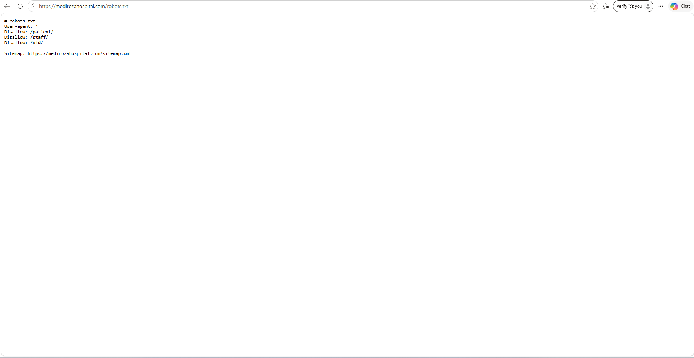
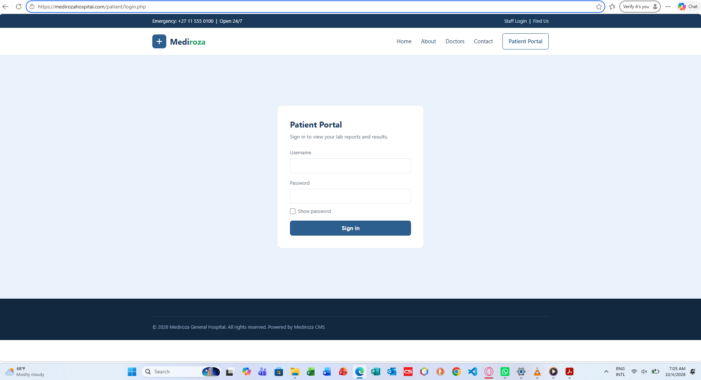
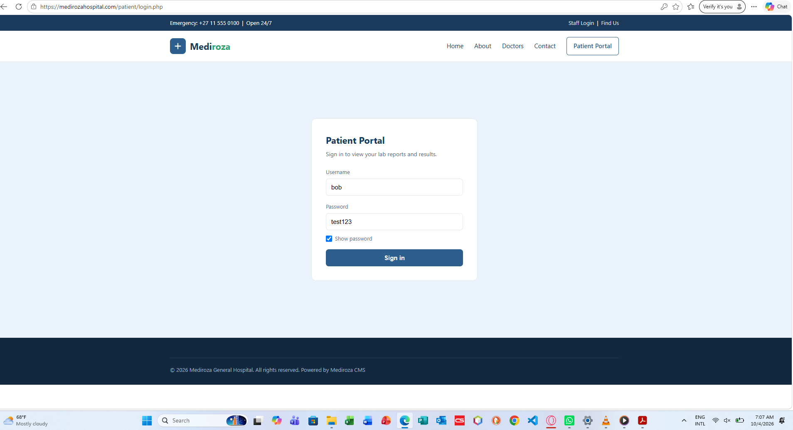

# 🎯 Week 4 - Capstone Penetration Testing Project: Mediroza General Hospital
Target Type Batch Status

NetworkWalks Academy | Cybersecurity & Ethical Hacking Internship (Batch B082) Capstone Engagement: Black-Box Penetration Testing Target : Mediroza General Hospital Instructor: Waqas Karim (CCIE) Intern: Mithun Kumar Rajak

📋 Executive Overview
In Week 4, the capstone assignment required conducting an end-to-end Black-Box Penetration Test against the web infrastructure of Mediroza General Hospital.

The objective was to evaluate the hospital's security posture as an unauthenticated external attacker, uncover security weaknesses, evaluate real-world business risks (such as patient health data and corporate asset exposure), and deliver an actionable remediation roadmap.

📑 Project Parameters
Parameter	Specification
Client Target	Mediroza General Hospital
Testing Type	Full Black-Box (Zero prior knowledge or insider access)
Duration	3 Days
Rules of Engagement	Strict target boundaries; no Denial of Service (DoS); no social engineering or phishing
Authorization	Authorized educational engagement by NetworkWalks Academy & client

# 🏥 Milestone 1: Initial Access & Report Retrieval
**What was required:**Gain unauthorized access to the hospital's patient portal and retrieve three confidential patient laboratory reports.
How we did it:
During reconnaissance, discovered public and restricted portal routes.
Identified an authentication bypass flaw on the patient login page, allowing entry without valid credentials.
Once inside, identified an access control weakness on the report download feature that allowed downloading records belonging to other patients.
Outcome: Successfully retrieved all 3 target patient laboratory PDF reports.
# Step 1. Recon

# Step 2. Find the login page

# Step 3. Username enumeration

Username not found

# 🔓 Milestone 2: Document Decryption & Data Extraction
**What was required:**Crack the password encryption protecting the three retrieved patient PDF documents.
How we did it:
Analyzed the document security properties, identifying standard 128-bit encryption.
Conducted an offline dictionary analysis against the security handler using common password lists.
Identified that predictable, low-complexity passwords had been assigned to the documents.
Outcome: Successfully decrypted all 3 patient PDF files, uncovering the underlying medical diagnostic information.

# 💼 Milestone 3: Sensitive Asset Discovery
**What was required:**Locate confidential internal hospital organizational assets, specifically staff salary registers and shareholder ownership details.
How we did it:
Identified an open directory listing misconfiguration on a legacy server directory.
Discovered an exposed internal database backup archive left in the web root.
Inspected the archive contents to extract staff remuneration data and corporate shareholder distributions.
Outcome: Successfully identified records for 30 staff members across multiple hospital departments and 10 corporate equity holders.

# 📑 Milestone 4: Penetration Testing Report Deliverable
**What was required:**Author a professional, industry-standard penetration testing report documenting all identified vulnerabilities, their risk ratings, and strategic remediation steps.
How we did it:
Documented all 8 technical findings and assigned CVSS v3.1 severity scores.
Applied healthcare compliance standards (HIPAA § 164.312, POPIA, GDPR) to assess regulatory exposure.
Sanitized all sensitive personal and financial data to ensure safe public/portfolio disclosure.
Formulated a prioritized remediation roadmap covering immediate, short-term, and long-term fixes.
Outcome: Produced complete executive and technical pentest deliverables ready for leadership and technical teams.

# 🛡️ Core Defensive Recommendations
Use Parameterized Queries: Always separate SQL application code from user input to eliminate injection vectors.
Enforce Server-Side Ownership Checks: Ensure user session identities match the requested data before serving documents.
Disable Directory Browsing: Turn off directory indexing on web servers and never store database backups in web-accessible paths.
Upgrade Encryption Standards: Adopt modern AES-256 encryption with high-entropy, randomly generated passphrases for sensitive documents.
Implement Defense-in-Depth: Deploy Web Application Firewalls (WAF), enforce multi-factor authentication (MFA), and suppress detailed system error messages.
